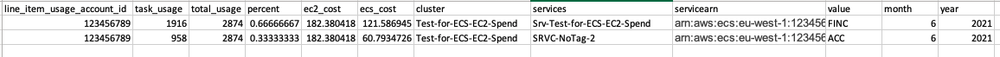

# ECS Chargeback

## Descriptions

This set of instructions will walk a user through the implementation of an automated report to show costs associated with ECS Tasks leveraging EC2 instances within a Cluster. 

When the report is ran, it will display ECS Task costs aggregated by a specified Tag. In this case, based on Business Unit (BU). 

The report will run at 12:30PM on the last day of the month to collect data and a crawler will check for new data at 13:30PM. Alternatively, the report can be manually executed.

There are two accounts involved in this:
* The Analytics account - where your CUR is and where the collector will be deployed

* The Management account - where your AWS Organization is 


---
**NOTE**

If your CUR is in your Management account and you wish to deploy this solution in there as well, then ignore the Analytics account and deploy all to the Management account.

---


## Pre-Requisites  
### Cost and Usage Report 


* Completion of  Well-Architected Lab: [100_1_aws_account_setup](https://wellarchitectedlabs.com/cost/100_labs/100_1_aws_account_setup/) or similar setup of the Cost and Usage Report (CUR) with resource Id enabled
* A CUR file has been established for the existing Management/Payer account within the Billing Console. 
* The ECS Cluster leveraging EC2 instances for compute resides in a Linked Account connected to the Management Account through the "Consolidated Billing" option within the Billing Console. 
* AWS generated tag is active in Cost Allocation Tags *resource_tags_aws_ecs_service_Name*
* User-defined cost allocation tags *Name* is active
* You will need an S3 bucket in your Analytics account to upload source files into
* Your Tasks MUST have the Name of the Service as a tag *Name*. This is best done with [Tag propagation](https://docs.aws.amazon.com/AmazonECS/latest/developerguide/ecs-using-tags.html) on service creation, see below:


### Code setup
* Upload files to s3 bucket of your choice in Analytics account but they both must be in the *same Region*. This will be reffered to as *CodeBucket* in the parameters. Make sure you load them into a *cloudformation* folder.

```aws s3 cp Analytics_Account/ecs_data.yaml s3://<CodeBucket>/cloudformation/ecs_data.yaml```

```aws s3 cp Analytics_Account/get_accounts.yaml s3://<CodeBucket>/cloudformation/get_accounts.yaml ```
``` cd source ```

```zip ecs.py.zip ecs.py```
``` cd .. ```
```aws s3 cp source/ecs.py.zip s3://<CodeBucket>/cloudformation/ecs.py.zip```

* Create a Role called *ECS_Read_Only_Role* in all accounts for which you will need to see the ECS data by using the file: *role.txt*. This file sets the appropriate permissons and trusted relationships. 
Before creating the roles, edit the "Trusted Relationship" section in the role.txt file by replacing *<AnalyticsAccountID>* with the ID of the Analytics Account where the collector will be placed. You can roll this out through all accounts in your org by using StackSets, see information [here](https://aws.amazon.com/blogs/aws/new-use-aws-cloudformation-stacksets-for-multiple-accounts-in-an-aws-organization/)

## Main Steps:
1. Follow and successfully complete the steps for either the AWS CLI or Console deployment options
2. Manually test the deployment
3. Create the necessary Views within Athena
4. Manually execute the cost allocation report

## Deployment Options

### Option 1: CLI Cloudformation
Ensure you have the AWS CLI installed on your machine in order to execute the commands below. If needed, follow these instructions to install the [AWS CLI](https://docs.aws.amazon.com/cli/latest/userguide/cli-chap-install.html)

1. Locate the two .json files and edit each of the variables with the appropriate information pertaining to your deployment.

2. Run the below command  to deploy the cloud formation stacks into your Analytics account where your ECS cluster is
``` aws cloudformation create-stack --stack-name ecschargeback --template-body file://Analytics_Account/main.yaml --capabilities CAPABILITY_NAMED_IAM --parameters file://Analytics_Account/main_parameter.json --profile <Analytics account>```

* Run the below command  to deploy the cloud formation stacks into your Management account where your CUR is
``` aws cloudformation create-stack --stack-name man-setup-ecs-chargeback --template-body file://Management_Account/Management.yaml --capabilities CAPABILITY_NAMED_IAM --parameters file://Management_Account/managment_parameter.json --profile <management account>```


### Option 2: Console Cloudformation

#### Step 1: Configure Analytics Account

* Login to your Analytics account where your CUR is and go to the CloudFormation service page
* Click on the "Create Stack" drop down list and select the option "with new resources" 
* Under the Section "Specify template" select the option "Upload a template"
* Select "Choose file" and upload the *main.yaml* file
* Click "Next"
* Fill in the needed parameters
* Click "Next" 
* Enter any desired Tags and click "Next" 
* Review the selected configuration options and select the checkbox indicating your acknowledgement. 
* Click "Create Stack" to deploy the solution. 

#### Step 2: Configure Management Account

* Login to your Managment account and go to the CloudFormation service page
* Click on the "Create Stack" drop down list and select the option "with new resources" 
* Under the Section "Specify template" select the option "Upload a template"
* Select "Choose file" and upload the *Management.yaml* file inside the Management_Account folder
* Click "Next"
* Fill in the needed parameters
* Click "Next" 
* Enter any desired Tags and click "Next" 
* Review the selected configuration options and select the checkbox indicating your acknowledgement. 
* Click "Create Stack" to deploy the solution.

### Manually Test Solution

After completing the deployment of the solution using either option above, you can test if the deployments were successful. 

* Login to your Analytics account and go to the AWS Lambda service page
* Locate the Function Named "AWS-Organization-Account-Collector" in the list --Need to update the naming typo for "organization" in the code
* Select the radio button next to the name and then click on the "Actions" drop down list and select "Test"
* In the "Test Event" section, select "Test" 
	-- If successful, a box should appear indicating success along with preliminary results. 

* Go to the "AWS Glue" service page
* In the menu on the left, select "Crawlers"
* Locate the Crawler named "ecs-services-clustersCrawler"
* Select the checkbox for the Crawler and click on "Run Crawler"
	-- After the Crawler successfully runs, you'll see a number populated in the "Tables updated" of "Tables added" column 
* Navigate to the Athena service
* Select the appropriate "Data source" and "Database" containing your pre-existing CUR file
	-- NOTE: The Database should be the same name as the "DatabaseName" parameter in the "management" YAML file 
* If the previous steps were successfull you will see a new table named "ecs_services_clusters_data"
* If the new table is there, preview the data by left-clicking on the 3 verticle dots to the right of the table name and select "Preview Table"

### Athena Configuration

* Navigate to the Athena service
* Select the appropriate "Data source" and "Database" containing your pre-existing CUR file
	-- NOTE: The Database should be the same name as the "DatabaseName" parameter in the "management" YAML file 
* Open a new query and paste in the SQL query from the file: "cluster_metadata_view" located in the nested "Athena" folder housed in the same folder the yaml files reside.
* Execute the query
* Open a new query and paste in the SQL query from the file: "ec2_cluster_costs_view" located in the nested "Athena" folder housed in the same folder the yaml files reside.
	-- Replace ${CUR} in the "FROM" clause with your CUR table name 
	-- For example, "curdb"."ecs_services_clusters_data" 
* Execute the query
* Open a new query and paste in the SQL query from the file: "bu_usage_view" located in the nested "Athena" folder housed in the same folder the yaml files reside.
	-- Replace ${CUR} in the "FROM" clause with your CUR table name 
	-- For example, "curdb"."ecs_services_clusters_data"
* Execute the query 


### Manually execute report

* Login to your Analytics Account and navigate to the Athena service
* Select the appropriate "Data source" and "Database" containing your pre-existing CUR file
	-- NOTE: The Database should be the same name as the "DatabaseName" parameter in the "management" YAML file 
 * Open a new query and paste in the SQL query from the file: "ecs_chargeback_report" located in the nested "Athena" folder housed in the same folder the yaml files reside.
	-- Replace "bu_usage_view.month" value with the appropriate month desired for the report
	-- For example, a value of '2' returns the charges for February 
* Execute the query


### Example Output



Breakdown: 
* total_usage: total memory resources reserved (in GBs) by all tasks over the billing period (i.e. – monthly)
* percent: task_usage / total_usage
* ec2_cost: monthly cost for EC2 instance in $
* Services: Name of service 
* servicearn: Arn of service
* Value: Value of specified tag for the ECS service (could be App, TeamID, etc?)

**Made by OPTICS**
---
**NOTE**

If you wish to test your data collection for one account then you can use the test.json file as the lambda test event and add the account id where <Account_id> is.

---

## Security

See [CONTRIBUTING](CONTRIBUTING.md#security-issue-notifications) for more information.

## License

This library is licensed under the MIT-0 License. See the LICENSE file.

